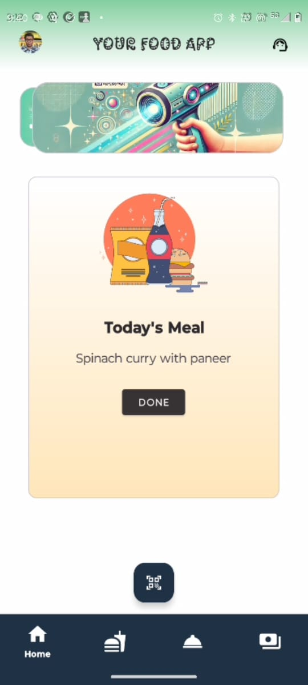
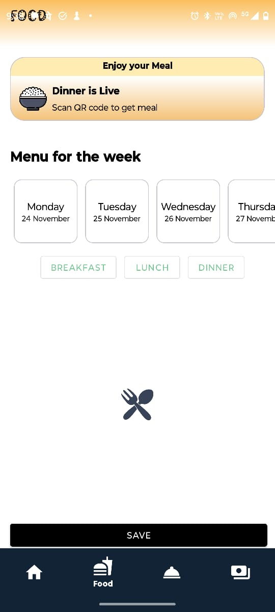
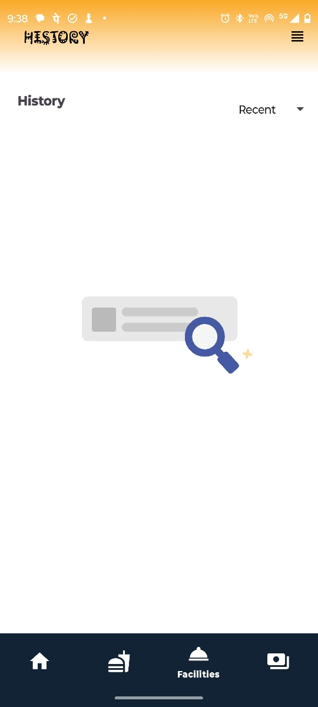

# 🥗 Food PG App

A clean and modern Android application built to help PG/Hostel residents view their weekly menu, scan to take meals, and keep track of their daily food consumption.  
The app allows users to scan a QR code to collect their meal up to **three times a day** (Breakfast, Lunch, Dinner), and it maintains a **history of which day and what time** the user has taken their food.  
Along with meal tracking, the app provides a beautiful UI with smooth navigation, daily menu highlights, dish cards, and category filters for Breakfast, Lunch, and Dinner.

---

## 📱 Screenshots

  
  
  
  

---

## 🎥 Preview

  

---

## 🍽️ Features

- 🗓️ View weekly menu at a glance  
- 🍛 Meal status banner (e.g., “Dinner is Live”, “Preparing your meal”)  
- 📅 Select any day of the week  
- 🍽️ Choose food categories: **Breakfast**, **Lunch**, **Dinner**  
- 🥘 Beautiful dish cards with title, description, and image  
- 🔘 Radio selection for dishes  
- 💾 "Save" button to confirm choices  
- 🎨 Aesthetic UI with smooth bottom navigation  
- ⚡ Fast, clean, and lightweight  

---

## 🛠️ Tech Stack

- **Kotlin**
- **Android Studio**
- **Material Components**
- **RecyclerView + CardView**
- **ViewModel + LiveData** (if used)
- **Firebase / Local Storage** (optional)

---

## 📦 Assets

Place all images and GIF previews inside the `assets/` folder:

## 🧩 Installation

You can Download the apk from the given link below :: 👇👇 
APK LINK 📩📩 : https://drive.google.com/file/d/1nHEu9APUD_5jGHzpn_b76kL27PVdVQ3-/view?usp=sharing 
😁😁
